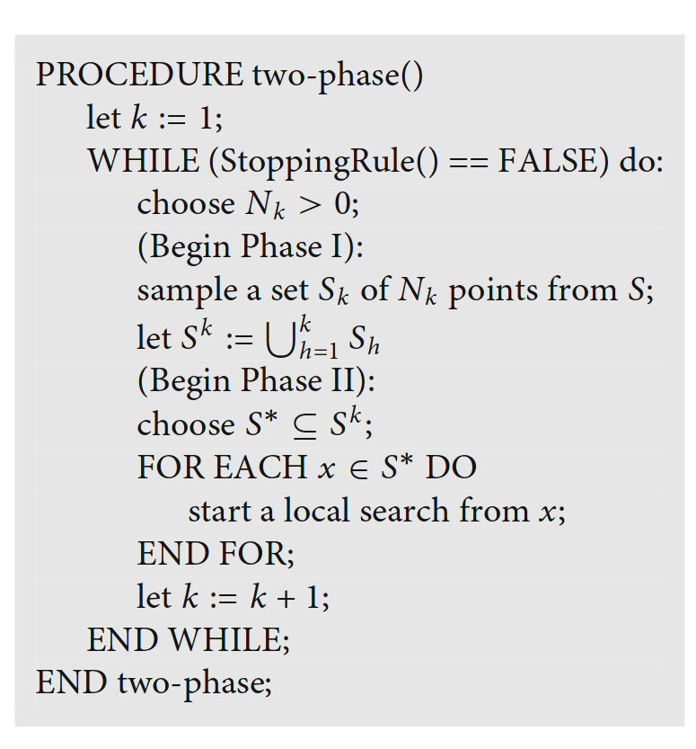

# Benchmarking Framework 

## Problems

- The main problem: Finding Ben Nevis on the whole GB height map.
- Local problems: Finding the highest point in a hand-picked region.
  - `nevis. schiehallion`
  - `nevis.macdui`
- (TODO) Tile problems: Finding the highest point in two-letter tiles, so that we have a large problem space. (low priority?)

## Algorithms

### Global Optimization: Two Phases

- Phase I: global phase

  - exploring the feasible region
  - makes use of uniform random sampling or quasirandom sequences (low-discrepancy, e.g. Sobol sequence)

- Phase II: local phase

  - main computational burden 

  - determined by the selection of $S^*$

    - pure random search: $S^*$ is empty
    - best start: $S^*$ is the set of point that has a function value strictly lower than the best so far has been observed
    - multistart: $S^*=S_k$ e.g. starting a local search from every sampling point
    - clustering: concentrating the sample by discarding a fixed fraction of the points with highest function values, which transforms the sampling to a non-uniform one. Clustering techniques are then employed to identify subsets of the sample with a higher-than-average concentration of points
    - topological search: $S^*$ is the set of points whose function value is lower than that of its $m$ nearest neighbors
      - SHGO is developed to improve topological search (the latter does not fully utilize information provided by function evaluations)
    - multilevel single-linkage (MLSL) and single linkage (SL)

    > The basic idea of this method (MLSL), which was analyzed in [8], is that, instead of building clusters with prescribed shape (e. g., ellipsoidal), points are clustered by means of a distance criterion. In particular a point is clustered to another in the sample if this latter is near enough and has a better function value. Local searches are started only from unclustered points.

Floudas, Christodoulos A., and P. M. Pardalos, eds. *Encyclopedia of Optimization*. 2nd ed. Springer Reference. New York: Springer, 2009.

### List of Algorithms

- Grid search
  - hyper-parameters
    - grid side length
- Random search
  - hyper-parameters
    - number of iterations
- CMA-ES
  - `pints` https://pints.readthedocs.io/en/stable/optimisers/cmaes.html
    - The CMA Evolution Strategy: A Tutorial Nikolaus Hanse, arxiv https://arxiv.org/abs/1604.00772
    - hyper-parameters
      - `sigma0`
      - `population_size`
- DIRECT
  - `nlopt` https://nlopt.readthedocs.io/en/latest/NLopt_Algorithms/#direct-and-direct-l
    - Jones, Donald R., and Joaquim R. R. A. Martins.  The DIRECT Algorithm: 25 Years Later.  *Journal of Global Optimization* 79, no. 3 (March 2021): 521 66. https://doi.org/10.1007/s10898-020-00952-6.
    - (no hyper-parameter)
- SHGO (used with local optimizers)
  - `scipy.optimize.shgo`  https://docs.scipy.org/doc/scipy/reference/generated/scipy.optimize.shgo.html
    - Endres, Stefan C., Carl Sandrock, and Walter W. Focke.  A Simplicial Homology Algorithm for Lipschitz Optimisation.  *Journal of Global Optimization* 72, no. 2 (October 2018): 181 217. https://doi.org/10.1007/s10898-018-0645-y.
    - hyper-parameters
      - `n` number of sampling points used in the construction of the simplicial complex
      - `iters` Number of iterations used in the construction of the simplicial complex
      - `sampling_method`
        - `sobol` is a quasi-random low-discrepancy sequence (designed to cover the space more evenly). It is deterministic but can be scrambled (randomized)
      - local minimizer
- Simulated Annealing (can be used with local optimizers)
  - `scipy.optimize.dual_annealing` https://docs.scipy.org/doc/scipy/reference/generated/scipy.optimize.dual_annealing.html
    - Xiang Y, Sun DY, Fan W, Gong XG. Generalized Simulated Annealing Algorithm and Its Application to the Thomson Model. Physics Letters A, 233, 216-220 (1997).
    - hyper-parameters
      - `maxiter`
      - `initial_temp`
      - `restart_temp_ratio`
      - `visit`
      - `accept`
      - `no_local_search`

  - hand coded version
    - hyper-parameters
      - `maxiter`
      - `step_size`
      - `initial_temp`
      - `restart_temp_ratio`
      - local optimizer
- Restart strategies
- (TODO) Differential evolution

- Local optimizers
  - BFGS
  - Nelder-Mead

### Hyper-Parameter Tuning

- Manual Search
  - needs understanding of the algorithms
  - hard to reproduce
- Grid Search
  - trying all possible combinations
  - computationally costly for higher dimensions
- Random Search
  - simple idea: independent draws from uniform density from parameter space
  - proved to have equal or better performance for manual or grid search (because often only a small number of hyper-parameters affect the performance)
  - random search is unreliable for training some complex models
  - Bergstra, James, and Yoshua Bengio.  Random Search for Hyper-Parameter Optimization,  n.d., 25.
- Bayesian Optimization
  - uses Gaussian processes and an acquisition function to derive the maximum of the objective function. Updates itself when a new observation is made
  - common acquisition functions:
    - probability of improvement (PI) (tends to be trapped in local optima)
    - expected improvement (EI) (preferred)
    - GP upper confidence bound (GP-UCB) (needs further hyper-parameters)

  - implementation
    - https://github.com/fmfn/BayesianOptimization

  - more complex than random search but likely to perform better
  
  - Hyperparameter Optimization for Machine Learning Models Based on Bayesian Optimization,  n.d. https://doi.org/10.11989/JEST.1674-862X.80904120.
  

## Performance

1. https://nlopt.readthedocs.io/en/latest/NLopt_Algorithms/#comparing-algorithms

  - > However, comparing algorithms requires a little bit of care because the  function-value/parameter tolerance tests are not all implemented in  exactly the same way for different algorithms. So, for example, the same fractional 10−4 tolerance on the function value might  produce a much more accurate minimum in one algorithm compared to  another, and matching them might require some experimentation with the  tolerances.
     >
     > Instead, a more fair and reliable way to compare two different  algorithms is to run one until the function value is converged to some  value *f*A, and then run the second algorithm with the minf_max [termination test](https://nlopt.readthedocs.io/en/latest/NLopt_Introduction#termination-conditions) set to minf_max=*f*A. That is, ask how long it takes for the two algorithms to reach the same function value.
     >
     > Better yet, run some algorithm for a really long time until the minimum *f*M is located to high precision. Then run the different algorithms you want to compare with the termination test: minf_max=*f*M+Δ*f*. That is, ask how long it takes for the different algorithms to obtain the minimum to within an absolute tolerance Δ*f*, for some Δ*f*. (This is *totally different* from using the ftol_abs termination test, because the latter uses only a crude estimate of the error in the function values, and moreover the  estimate varies between algorithms.)
2. Bartz-Beielstein, Thomas, Carola Doerr, Daan van den Berg, Jakob Bossek, Sowmya Chandrasekaran, Tome Eftimov, Andreas Fischbach, et al.  Benchmarking in Optimization: Best Practice and Open Issues,  2020. https://doi.org/10.48550/ARXIV.2007.03488.
3. Suganthan, P N, N Hansen, J J Liang, and K Deb.  Problem Definitions and Evaluation Criteria for the CEC 2005 Special Session on Real-Parameter Optimization,  n.d., 51.
4. Bossek, Jakob, Pascal Kerschke, and Heike Trautmann.  A Multi-Objective Perspective on Performance Assessment and Automated Selection of Single-Objective Optimization Algorithms.  *Applied Soft Computing* 88 (March 2020): 105901. https://doi.org/10.1016/j.asoc.2019.105901.
5. Hansen, Nikolaus, Anne Auger, Steffen Finck, and Raymond Ros.  Real-Parameter Black-Box Optimization Benchmarking 2009: Experimental Setup,  n.d., 20.

### Process

- termination criteria: terminates the algorithms when a maximum function evaluation number is reached OR we have reached >= a certain height (maybe 1340, sufficiently close to Ben Nevis).
  - `nlopt` (https://nlopt.readthedocs.io/en/latest/NLopt_Introduction/#termination-conditions use `stopeval`), `scipy`, and `pints` (https://pints.readthedocs.io/en/stable/optimisers/running.html use `set_threshold`) all support terminating the algorithms when reaching a particular function value
  - the criterion which terminates each run should be recorded. Try to make sure the algorithm terminates either due to reaching the designated height or reaching maximum function evaluations
- starting points: use the same random seed for generating starting points
- classification of runs
  - successful runs: we reach a certain height  (maybe 1317 for Ben Nevis and 1307 for Ben Nevis + Ben Macdui, see table in Appendix) before the algorithm terminates. We could also use distance to Ben Nevis
  - unsuccessful runs: the algorithm terminates because the maximum function evaluation number is reached or by itself before reaching the designated height

### Measures

- Maximum height reached at a certain number of function evaluations
  - data are aggregated (i.e. 0, 25, 50, 75, 100 percentiles and mean and std) across multiple runs
  - variant: the percentage of runs that are reach certain heights (e.g. 1000, 1100, 1200, 1300) at a a certain number of function evaluations
- Successful rate
  - (# of successful runs according to the table above) / total runs
- average function evaluations of successful runs
- Success performance [3]
  - mean (FEs for successful runs)*(# of total runs) / (# of successful runs)
- penalized average runtime [4]
  - average function evaluations, while the failed runs are considered as $f$ times of maximum allowed function evaluations. $f$ is by convention taken as 2 and 10, and thus we have PAR2 and PAR10

- dominated hypervolume [4]
  - successful rate * (maximum allowed function evaluations - average function evaluations of successful runs)
  - is correlated to par according to [4]
  
- expected running time [5]
  - average function evaluations of successful runs + (1 - successful rate) / (successful rate) * maximum allowed function evaluations

### Visualization

- Convergence plots (for a single algorithm and multiple algorithms)
  - showing maximum height reached at a certain number of function evaluations (as above)

- Boxplots and histograms
  - showing the distribution of performance measures across different runs 

- Plots for showing a single run
  - 2-D scatter plot and trajectory plot
  - 3-D plot using Google Earth

## Appendix

Height around Ben Nevis:

|      | radius | minimum height |
| ---: | -----: | -------------: |
|    0 |      0 |    1344.951376 |
|    1 |     10 |    1336.209441 |
|    2 |     25 |    1317.590389 |
|    3 |     50 |    1272.713262 |
|    4 |    100 |    1195.117503 |

Height around Ben Macdui:

|      | radius | minimum height |
| ---: | -----: | -------------: |
|    0 |      0 |    1309.008933 |
|    1 |     10 |    1308.352555 |
|    2 |     25 |    1307.353242 |
|    3 |     50 |    1305.608210 |
|    4 |    100 |    1297.653107 |

Height around the 3rd hill:

|      | radius | minimum height |
| ---: | -----: | -------------: |
|    0 |      0 |    1293.900024 |
|    1 |     10 |    1287.766844 |
|    2 |     25 |    1276.278256 |
|    3 |     50 |    1251.159347 |
|    4 |    100 |    1182.576007 |
