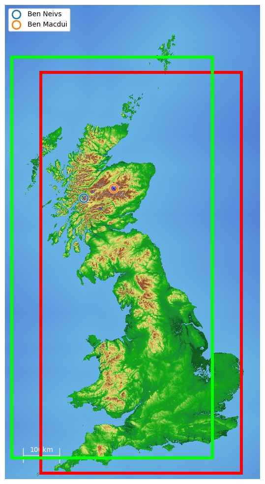

## What has been done?

- the `nevis` module
    - the function to be optimised
    - visualistion methods
    - hand-picked subproblems
- benchmarking framework
    - termination criteria for running each algorithm instance
    - performance measures for each algorithm instance
        - ERT, SP, PAR, HV
    - performance plots for each algorithm instance
        - aggregated convergence graph
        - stacked graph of runs within different height intervals
    - hyper-parameter tuning for selecting the best instance for an algorithm, using random search
- algorithms running on the framework
    - cmaes
    - dual annealing and simulated annealing
    - mlsl
    - shgo
    - multistart

## What needs to be done?

- random subproblems
  - this is needed because we have 1) deterministic methods like DIRECT and 2) methods relying on quasi-random low-discrepancy sequences (e.g. Sobol sequence) which are also deterministic, also 3) we want to mitigate over-fitting in hyper-parameter tuning 
  - in order not to break the performance measures and plots used in the benchmarking framework, a good way might be to "crop" the map but always include all of Scotland and Wales and most of England, as shown by the two rectangles in the image. In this way the maximum of the subproblem remains Ben Nevis and all the Munros are still included, and therefore all our plots and measures remain meaningful

- running the algorithms to obtain the data and results
  - need a powerful server for the methods to "converge"
  - might need to tweak the framework while running, e.g. how the results are stored
- more algorithms to try on this problem
  - particle swarm
  - ant colony optimisation
  - trying to invent new algorithms on this problem based on the results obtained from running the classic ones, probably by combining the ideas behind two or more different classic methods
- finishing writing the report 
  - also adjusting the plots so that they are more fit for the report
