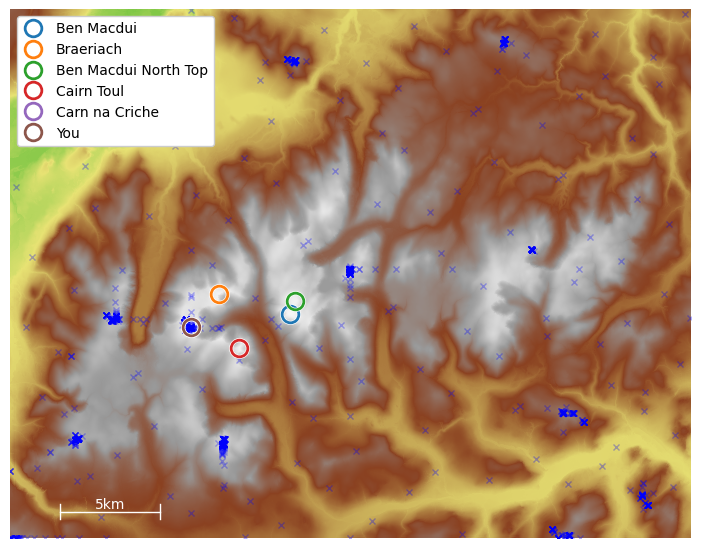
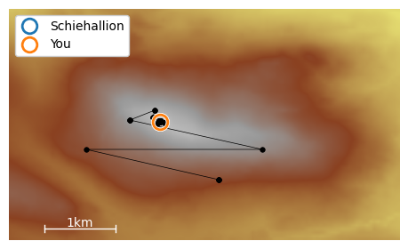
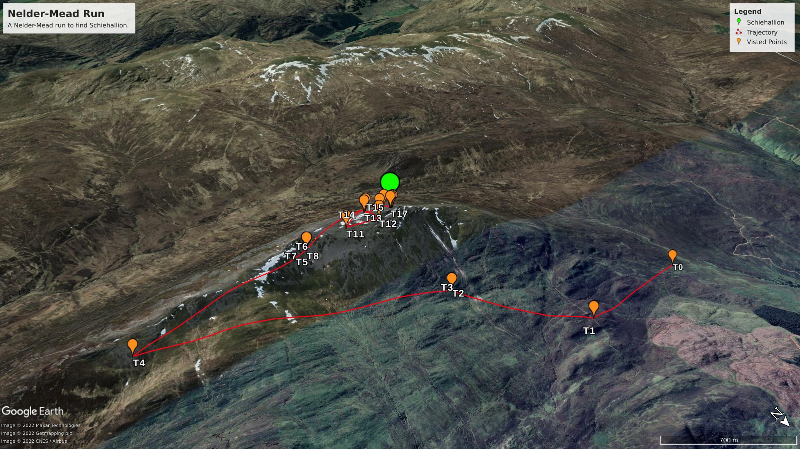
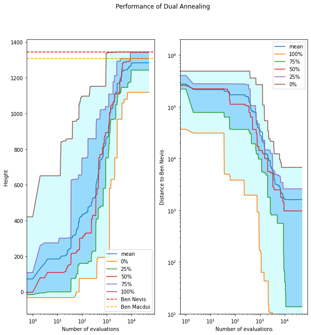

# Finding Ben Nevis

### Optimization on Great Britain height map

Yuhang WEI aka Eric

---

# What's been done so far?

1. The pip package `nevis`
2. A benchmark framework for comparing algorithms running on `nevis`

---

# The objective function

```python
import nevis
nevis.download_os_terrain_50() # Download the data when first run

f = nevis.linear_interpolant()
# z = f(x, y)
# (x, y) is given in metres, z is the altitude of the point

# In case we need the gradient (which is not continuous)...
f_grad = nevis.linear_interpolant(grad=True)
# z, (gx, gy) = f_grad(x, y)

# the domain of f is [0, x_max] x [0, y_max]
x_max, y_max = nevis.dimensions()
```

Our task is to maximize $f$ over its domain, and we know the global maximum point is Ben Nevis with height 1345m.

---

# Plotting methods

https://github.com/CardiacModelling/BenNevis/blob/main/examples/viewing-gb.ipynb

---

# Subproblem: Cairngorms Mountains

- a region that contains the 2nd to the 6th highest hills of GB
- a simpler problem for global optimizors

---

# Subproblem: Cairngorms Mountains

A run of SHGO on this region that ends up at Carn na Criche, the 6th highest hill of GB



---

# Subproblem: Schiehallion

- isolated from other hills & almost symmetric in shape
- can be used to test local optimisors

---

# Subproblem: Schiehallion

A run of Nelder-Mead that successfully finds Schiehallion



---

Another successful run with a different starting point, visualized using Google Earth

 

---

# More examples

- [Fitting with CMA-ES using PINTS](https://github.com/CardiacModelling/BenNevis/blob/main/examples/fitting-with-pints.ipynb)
  - Global optimization on the whole map
- [Fitting with Nelder-Mead using SciPy](https://github.com/CardiacModelling/BenNevis/blob/main/examples/fitting-with-scipy.ipynb)
  - Derivative-free local optimization on Schiehallion

- [Fitting with Method of Moving Asymptotes NLopt](https://github.com/CardiacModelling/BenNevis/blob/main/examples/fitting-with-nlopt.ipynb)
  - Gradient-based local optimization on Schiehallion

---

# Benchmark framework

List of algorithms to be considered (not exhaustive)

- Grid Search and Random Search (brutal force)
  - can be used with local optimizers
- CMA-ES [1]
- DIRECT and DIRECT-L Method [2]
- SHGO (simplicial homology global optimization) [3]
  - used with local optimizers
- Simulated Annealing and Dual Annealing [4]
  - can be used with local optimizers
- Local optimizers
  - BFGS
  - Nelder-Mead

---

# Benchmark framework

- Problem: which algorithm works the best on finding Ben Nevis?
- In other words, reaching somewhere sufficiently close to Ben Nevis (or somewhere sufficiently high) within a low number of function evaluations
- Two important pre-defined variables
  - $T_{\text{max}}$ maximum number of function evaluations allowed for each algorithm
  - $f_{s}$ only an algorithm run that reaches somewhere higher than this value can be classified as successful
- Two separate objectives
  - a high successful rate $r_s$: the ratio between the number of successful runs and all runs
  - a low average number of function evaluations for each successful run $\bar T_s$

---

# Performance measures

- They all somehow combines the two separate objectives
  - "success performance" $\bar T_s / r_s$ [8]
  - penalized average runtime, which is the average number of function evaluations with the failed runs  considered as $kT_{\text{max}}$, where $k$ is by convention taken as 2 and 10, and thus we have PAR2 and PAR10
    
  - dominated hypervolume $r_s (T_{\text{max}} - \bar T_s)$  [9]
    - is correlated to PAR according to [9]
    
  - expected running time $\bar T_s + (1 - r_s) / r_s T_{\text{max}}$ [10]

- ERT seems to be the most appropriate one so far

---

# Performance plots

- Convergence plot: maximum height reached at a certain number of function evaluations [7]
  - data are aggregated (i.e. 0, 25, 50, 75, 100 percentiles and mean and std) across multiple runs
  - variant: the percentage of runs that are reach certain heights (e.g. 1000, 1100, 1200, 1300) at a a certain number of function evaluations (to-do)

---



---

# Hyper-parameter tuning

- Some algorithms might have one or more hyper-parameters, e.g. population size for CMA-ES and initial temperature for simulated annealing
- Finding an appropriate set of hyper-parameters is another optimization problem
  - the goal is to optimize a chosen performance measure, e.g. ERT
- We currently use Random Search for this purpose
  - RS is proved to have equal or better performance for manual or grid search (because often only a small number of hyper-parameters affect the performance) [5]
  - will try Bayesian optimization (said to outperform RS in more complex situations) [6]

---

# Benchmark framework

- **An algorithm** contains
  - a function that takes hyper-parameters and returns an optimization result
  - a hyper-parameter space (the range of values they can take)
  - multiple **algorithm instances** (or one if there is no hyper-parameter)
- **An algorithm instance** contains
  - an algorithm
  - a particular set of hyper-parameter
  - multiple **run results** (or one if it is a deterministic algorithm)
- **A run result** contains
  - the found optimization point and value
  - a list of all visited points
  - a message that explains why the run was terminated

---

# Benchmark framework

- **A run result** can
  - be classified as successful or failed
  - be visualized using 2D plots or Google Earth
  - be saved and loaded
- **An algorithm instance** can
  - run and obtain multiple results
  - calculate its performance measure using (the classification of) its run results
  - plot its converge graph using its run results 
- **An algorithm** can
  - tune its hyper-parameters by generating random algorithm instances and picking the one with the best performance measure

---

# Work flow

```python
def run_dual_annealing(**kwargs):
    # ...
    ret = dual_annealing(
        wrapper, 
        bounds=[(0, x_max), (0, y_max)],
        maxfun=MAX_FES,
        **kwargs
    )

    return Result(
        ret.x,
        -ret.fun,
        points,
        ret.message,
    )

algo = Algorithm(
    name='Dual Annealing', 
    func=run_dual_annealing,
    param_space={
        'maxiter': [1500, 2000, 2500],
        'initial_temp': np.linspace(2e4, 4e4, 1000),
        'restart_temp_ratio': np.logspace(-5, -3, 100),
    },
)
```

---

# Work flow

```python
algo.tune_params(
    measure='ert',
    mode='min'
)
algo_instance = algo.best_instance

print(algo_instance.success_measures())

algo_instance.plot_convergence_graph()
plt.show()
```

taken from [here](https://github.com/CardiacModelling/EricSummer2022/blob/main/test-frame.ipynb)

---

# Summary

- The pip package `nevis`

  - **an objective function** which mimics GB terrain using Ordnance Survey data and linear interpolation 

  - methods to **visualize optimization processes**, including plotting global or partial 2D maps and and exporting to Google Earth

  - **pre-defined subproblems** that are easier to solve or more suitable for testing local optimizors

  - **examples** of how to apply different optimization algorithms to this problem and visualize them

---

# Summary

- A benchmark framework for comparing algorithms running on `nevis`
  - **a process and several measures and plots** to compare the performance of different algorithm instances
  - **hyper-parameter tuning** using random search 
  - **a hierarchy** of algorithms, algorithm instances, and run results

---

# To-dos

- More performance plots for algorithm instances, especially plots for comparing different instances
- More algorithms to consider
- Bayesian optimization as a hyper-parameter tuning method
- Applying the benchmark framework to all proposed algorithms in a consistent way and finding out which one is doing the best
- Perhaps explaining the performance of the algorithms on our problem by examining their visualized optimization process

---

# References

1. Hansen, Nikolaus.  The CMA Evolution Strategy: A Tutorial.  arXiv, April 4, 2016. http://arxiv.org/abs/1604.00772.


2. Jones, Donald R., and Joaquim R. R. A. Martins.  The DIRECT Algorithm: 25 Years Later.  *Journal of Global Optimization* 79, no. 3 (March 2021): 521 66. https://doi.org/10.1007/s10898-020-00952-6.
3. Endres, Stefan C., Carl Sandrock, and Walter W. Focke.  A Simplicial Homology Algorithm for Lipschitz Optimisation.  *Journal of Global Optimization* 72, no. 2 (October 2018): 181 217. https://doi.org/10.1007/s10898-018-0645-y.
4. Xiang Y, Sun DY, Fan W, Gong XG. Generalized Simulated Annealing Algorithm and Its Application to the Thomson Model. Physics Letters A, 233, 216-220 (1997).
5. Bergstra, James, and Yoshua Bengio.  Random Search for Hyper-Parameter Optimization,  n.d., 25.

---

6. Hyperparameter Optimization for Machine Learning Models Based on Bayesian Optimization,  n.d. https://doi.org/10.11989/JEST.1674-862X.80904120.

7. Bartz-Beielstein, Thomas, Carola Doerr, Daan van den Berg, Jakob Bossek, Sowmya Chandrasekaran, Tome Eftimov, Andreas Fischbach, et al.  Benchmarking in Optimization: Best Practice and Open Issues,  2020. https://doi.org/10.48550/ARXIV.2007.03488.
8. Suganthan, P N, N Hansen, J J Liang, and K Deb.  Problem Definitions and Evaluation Criteria for the CEC 2005 Special Session on Real-Parameter Optimization,  n.d., 51.
9. Bossek, Jakob, Pascal Kerschke, and Heike Trautmann.  A Multi-Objective Perspective on Performance Assessment and Automated Selection of Single-Objective Optimization Algorithms.  *Applied Soft Computing* 88 (March 2020): 105901. https://doi.org/10.1016/j.asoc.2019.105901.
10. Hansen, Nikolaus, Anne Auger, Steffen Finck, and Raymond Ros.  Real-Parameter Black-Box Optimization Benchmarking 2009: Experimental Setup,  n.d., 20.

---

# The end

Thank you for listening :-) 
